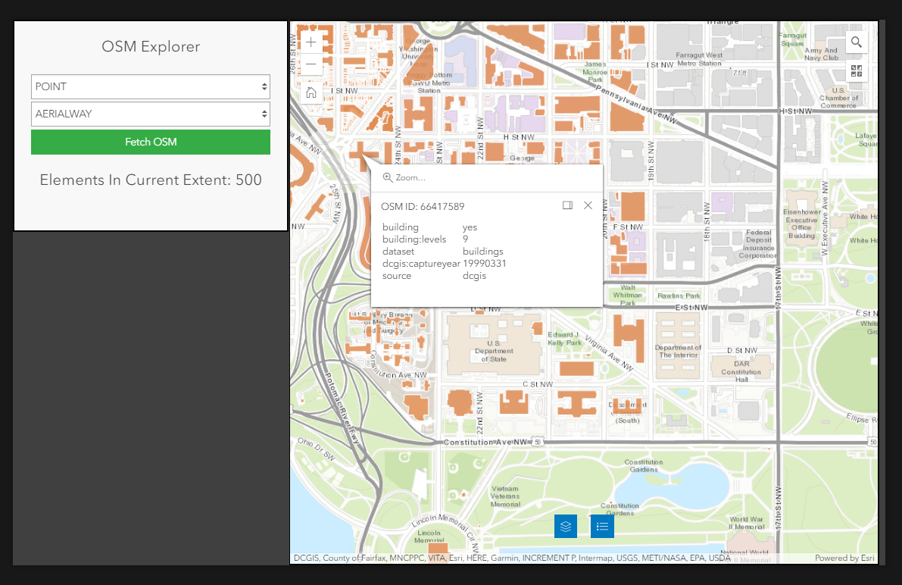
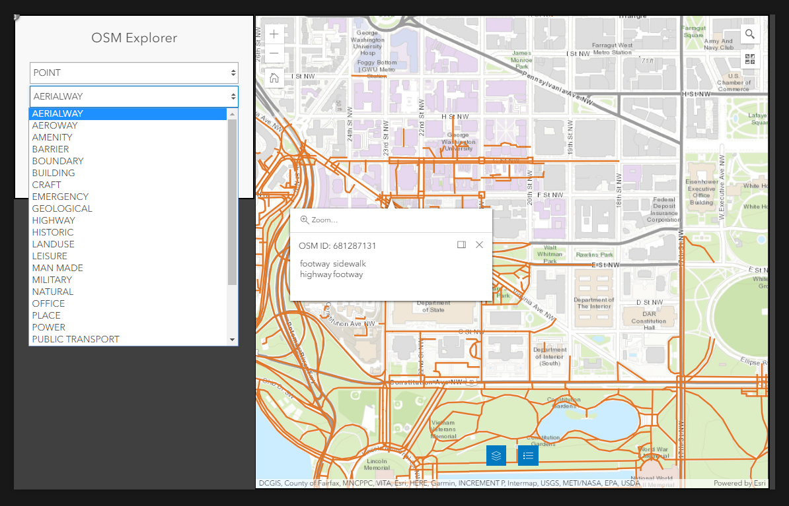

# OSM Explorer - Experience Builder Widget

This is a simple Experience Builder Widget that can be used to discover OSM features within a
given extent. First choose the feature type you want to find (point, line, or polygon), and then
choose a tag (e.g. building or highway) to start exploring.

## Dependencies

[Esri Calcite Components](https://github.com/Esri/calcite-components)

## Examples

